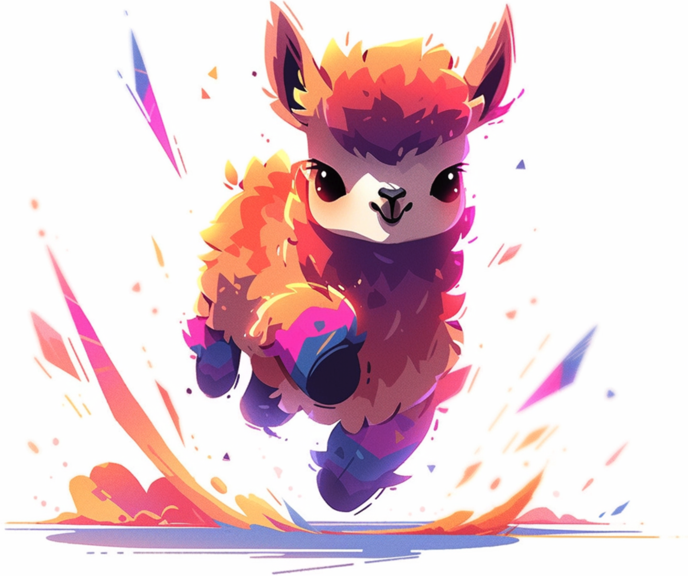

# ASCII Art Integration

This presentation demonstrates how to include ASCII art generated from images.

The system supports the `!\[ascii\](image_path)` syntax.

---

# ASCII Art Example

Here's an ASCII version of our mascot:



Pretty cool, right? The ASCII art is generated automatically from the image file.

---

# How It Works

## Features
- Automatic **ASCII conversion** from images
- **Caching** for performance
- **Error handling** for missing files
- Integration with existing `AsciiImage` module

## Supported Formats
- PNG images
- JPEG images  
- Any format supported by ImageMagick

---

# Implementation Details

The ASCII processor:

1. **Finds** `!\[ascii\](path)` references in markdown content
2. **Converts** images using ImageMagick 
3. **Caches** results for performance
4. **Replaces** markdown with ASCII art text

```elixir
# Usage in slides
content = "Check this out: "
result = AsciiProcessor.process_ascii_art(content)
```

---

# Thank You!

ASCII art makes presentations more **visual** and **engaging**.

Try it in your own presentations with the `!\[ascii\](path)` syntax format.

Questions?