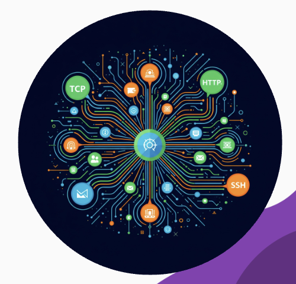

# 

**August 28-29, 2025 | Orlando, FL**

<!-- poll:
question: "What's your Elixir experience level?"
options:
- "New to Elixir (0-6 months)"
- "Getting comfortable (6 months - 2 years)"
- "Experienced (2-5 years)"
- "Elixir veteran (5+ years)"

the ElixirConf US Logo slides
[Walk on with confidence, pause, look at audience]
 -->

---

# Start Spicy?

## 🌶️ Spicy Start 🌶️

## Modern Software Engineering is broken

<!-- poll:
question: "How do you feel about this spicy take: 'Modern Software Engineering is broken'?"
options:
- "🔥 Totally agree - it's a mess!"
- "🤔 Partially true, but not entirely"
- "😤 Disagree - modern tools are great"
- "🍿 Just here for the drama"
-->

<!-- Speaker notes:
[This is our hook slide - pause here to let the audience take in the title and build anticipation
Wait for full attention before proceeding]

Jerry, should we start this presentation on a spicy note?

Yes we should

Your Kubernetes cluster. Your microservices mesh. Redis. Message queues. Load balancers. Half your monitoring stack.
[Pause]
They're all solving problems that shouldn't exist in the first place."

"For decades, we've scaled by piling on complexity. Microservices to handle load. Containers to manage the services. Meshes to manage the containers. Observability to understand the mesh.
We've built skyscrapers of duct tape… and called it 'modern software engineering.'"

[Make eye contact, pause after each item for impact]
 -->

---

# There is a better way

## It's been here the whole time

<!-- poll:
question: "How complex is your current tech stack?"
options:
- "🏗️ It's a Kubernetes nightmare"
- "📦 Docker + microservices maze"
- "🎯 Pretty simple, mostly monolith"
- "🤷 What's a tech stack?"
-->

<!-- Speaker notes:
[THE CONTRAST - Introduce the alternative]
"But what if I told you there's a 30-year-old technology designed from day one to run millions of concurrent processes, self-heal, and scale effortlessly—without the Rube Goldberg machine?"

Use the image to emphasize the complexity we're about to challenge -->

---

# Spoiler Alert:

## It was Elixir all along

**Let's explore what's possible with pure Elixir/OTP...**

<!-- poll:
question: "What's your biggest Elixir surprise so far?"
options:
- "🤯 It can do THAT much built-in?"
- "⚡ The performance is incredible"
- "🧠 Pattern matching changed my life"
- "📚 Still learning the basics"
-->

<!-- Speaker notes:

[1:10-1:35] THE REVELATION - Connect to real-world success
"That technology is Elixir, built on the Erlang VM—the same platform behind WhatsApp's billions of messages, Discord's real-time chat, and telecom systems that hit nine nines of uptime.
While we were reinventing the wheel with Docker and Kubernetes, telecom solved this in the 80s."

But first let's (breifly) look at what we can do with "naked" Elixir

-->

---

# Hello Cleveland! 👋

# Elixir is all you need

## Christian Koch & Jeremy Searls

**💼 Connect with us:**

- **Christian Koch**: ckochx@gmail.com
- **Jeremy Searls**: @jersearls on every platform
- **Source Code**: https://github.com/ckochx/ElixirNoDeps

<!-- poll:
question: "What's your approach to adding dependencies?"
options:
- "📦 npm install all the things!"
- "🤔 Carefully evaluate each one"
- "🙈 Copy code when possible"
- "🔨 Build everything from scratch"
-->

<!-- Speaker notes:
[0:00-0:20] THE HOOK - Deliver with confidence and energy

Hi everyone I'm Christian and this is Jerry and we're here to make you mad
(possibly)
with our talk titled "Elixir is all you need"

[GO FAST for next 5 slides: Jerry, CK, Jerry, CK, Jerry]
-->

---

# You Can Do A LOT With Just Elixir

## No Dependencies Required

## Built-in SSH Support

- **SSH client**: `:ssh` module
- **SSH tunnels**: Port forwarding
- **Key management**: Built-in support
- **No external libraries needed!**

<!-- poll:
question: "How often do you use SSH in your applications?"
options:
- "🚀 Daily - it's essential"
- "📅 Occasionally for deployments"
- "🤷 Rarely, mostly for server access"
- "😱 Never thought of using it in apps"
-->

<!-- Speaker notes:

This slide demonstrates the first example of built-in capabilities. Emphasize "No external libraries needed!" -->

---

# HTTP Clients & HTTP Servers

## Complete HTTP Stack

- **HTTP client**: `:httpc` module
- **HTTP server**: `:httpd` module
- **SSL/TLS**: Built-in support
- **REST APIs**: Full implementation

<!-- poll:
question: "What's your go-to for HTTP in Elixir?"
options:
- "🚀 HTTPoison/Finch + Plug/Phoenix"
- "🔧 Built-in :httpc and :httpd"
- "🎯 Tesla for clients, Phoenix for servers"
- "🤔 Wait, there are built-in options?"
-->

<!-- Speaker notes:
Continue building the case for built-in capabilities. This shows HTTP is not just client OR server - it's BOTH.
Emphasize that these are production-ready modules, not toy implementations -->

---

# ETS for Caching

## High-Performance In-Memory Storage

- **Lightning fast**: Native Erlang tables
- **Atomic operations**: Built-in concurrency
- **Memory efficient**: Optimized storage
- **No Redis required!**

<!-- poll:
question: "What's your caching solution of choice?"
options:
- "⚡ Redis - the classic"
- "📊 ETS - built into BEAM"
- "🏗️ Memcached for simplicity"
- "😅 What's caching? Just query the DB!"
-->

<!-- Speaker notes:

ETS is incredibly powerful - emphasize "No Redis required!" as this often surprises people -->

---

# Persistent Term for Durable Storage

## Fast, Immutable Cache

- **Persistent across restarts**: Built into OTP
- **Immutable by design**: Functional approach
- **Fast access**: Optimized for reads
- **No database needed for simple data!**

<!-- poll:
question: "How do you handle application configuration/state?"
options:
- "📦 Environment variables everywhere"
- "📊 Database for all persistent data"
- "🚀 GenServer state + ETS/Persistent Term"
- "🤷 Mix of everything, it's chaos"
-->

<!-- Speaker notes:
Persistent Term is often overlooked but incredibly useful. This is where you can mention that sometimes you don't need a full database - just fast, durable storage.
"Sometimes the simplest solution is the best solution" -->

---

# Escript & Release for Binaries

## Deployable Applications

- **Escript**: Single-file executables
- **Release**: Production deployments
- **Hot code swapping**: Runtime updates
- **Self-contained**: No external deps

<!-- poll:
question: "How do you deploy your Elixir apps?"
options:
- "🚀 Elixir releases (mix release)"
- "📦 Docker containers"
- "☁️ Cloud platforms (Fly.io, Gigalixir, etc.)"
- "😅 What's deployment? It works on my machine!"
-->

<!-- Speaker notes:
[1:35-1:50] THE PROMISE - Set up what's coming
"Today, I'll show you why Elixir isn't just another language—it's a paradigm shift that can replace your entire backend architecture.
Sometimes, the future means going back to fundamentals that actually work."

And to package up all your source code, we have two powerful tools: escript and releases.
(runtime included!)
The "packaged" files are self contained and have everything they need to run themselves.
Docker not required!

This slide shows deployment capabilities. Emphasize "Self-contained" - no Docker needed! -->

---

# But What If You DO Need Dependencies?

## We Need to Evaluate Tradeoffs

**Let's have an honest conversation about dependency management...**

<!-- poll:
question: "How do you evaluate adding a new dependency?"
options:
- "📊 Look at GitHub stars and download counts"
- "🔍 Deep dive: code quality, maintenance, tests"
- "⏱️ If it saves time, add it immediately"
- "😅 YOLO - just mix deps.get and pray"
-->

<!-- Speaker notes:

Transition slide - acknowledge that dependencies aren't always bad, but we need to be smarter about them.
This is where we pivot from "built-in is great" to "dependencies need evaluation" -->

---

# The Reality of Dependencies

## Active Support Questions

- **Is it actively maintained?**
- **Repo abandonment/orphanage is real**
- **Fewer open source contributors**
- **Time pressure and social issues**

## Corporate Sponsorship

- **Is there corporate backing?**
- **Long-term viability assessment**
- **Community health indicators**

<!-- poll:
question: "What's your biggest concern with dependencies?"
options:
- "😱 Abandoned/unmaintained packages"
- "🔒 Security vulnerabilities"
- "🏗️ Breaking changes in updates"
- "📏 Too many transitive dependencies"
-->

<!-- Speaker notes:

You have to look at every dependency critically.

The "repo abandonment/orphanage" point is crucial - this is happening across the industry.

Emphasize that corporate sponsorship isn't always bad - it can mean long-term stability

 -->

---

# The Dependency Dilemma

## Traditional Engineering Approach

- **Senior engineer consultation required**
- **Tradeoff evaluation meetings**
- **Risk assessment processes**
- **Time-consuming decision making**

## Modern Reality

- **Faster development cycles needed**
- **More complex dependency graphs**
- **Supply chain security concerns**

<!-- poll:
question: "How are dependency decisions made at your company?"
options:
- "👥 Team discussion and consensus"
- "💼 Senior engineer/architect approval"
- "🏃 Individual developer choice"
- "🤷 No formal process, it just happens"
-->

<!-- Speaker notes:
Contrast the old way (slow, bureaucratic) with the new reality (fast, complex, insecure).
This sets up the need for a new approach to dependency management -->

---

# Handling Under-Supported Repos

## The Fork Question

- **Do you fork everything?**
- **Is that better for you?**
- **Maintenance burden transfer**
- **What if you only need ⅓ of functionality?**

## The 80/20 Rule

- **Most libraries are over-engineered**
- **You often need just the core features**
- **The rest adds complexity without value**

<!-- poll:
question: "When a library becomes unmaintained, you:"
options:
- "🔱 Fork it and maintain your own version"
- "🚀 Find an actively maintained alternative"
- "✏️ Copy the code you need into your project"
- "😅 Keep using it and hope for the best"
-->

<!-- Speaker notes:

What if the repo is just gathering dust? Open issues? Unmerged trivail pull requests?
And what if you only need 20% of the functionality in the repo?

The 80/20 rule is key here - most people only use a small fraction of what libraries provide.
"What if you only need ⅓ of functionality?" - this often resonates with developers -->

---

# Libraries: Encapsulation vs. Obfuscation

## The Tradeoff

- **Encapsulation**: Namespacing
- **Obfuscation**: Hiding what's happening**
- **Transparency**: See the code you're using
- **Control**: Understand your dependencies

## Not Every Library is Unnecessary

- **Postgrex**: Very specific, complex problem
- **Ecto**: Modular database abstraction
- **But could you write SQL directly?**

<!-- poll:
question: "Do you prefer libraries that:"
options:
- "🎩 Hide complexity (magic functions)"
- "🔍 Show you exactly what's happening"
- "⚖️ Balance of both depending on use case"
- "🤷 I don't think about it much"
-->

<!-- Speaker notes:
"Well a library is both encapsulation and obfuscation. Not to suggest that every library is unnecessary.
Some are very specific or solve a complex problem in a modular fashion, for example postgrex.
But could you write an app with DB access and not use Ecto? Only write SQL? Maybe. It's something to consider."

This shows we're not being dogmatic - some libraries are genuinely valuable -->

---

# The Orphanage Problem

## Repo Abandonment Reality

- **Timex author largely moved on from Elixir**
- **Fewer open source contributors**
- **More disincentive to contribute**
- **Time pressure and social issues**

## Across Software Engineering

- **Not just an Elixir problem**
- **Industry-wide trend**
- **Corporate consolidation impact**

<!-- poll:
question: "Have you experienced using an abandoned/orphaned package?"
options:
- "😱 Yes, and it broke our production"
- "😟 Yes, but we managed to work around it"
- "😅 Not yet, but I'm worried about it"
- "🍀 Nope, we're lucky so far"
-->

<!-- Speaker notes:

Aside: "The Orphanage Problem" sounds like a darker version of the Trolley Experiment

[This is the harsh reality check.]

"Timex solved such a vital problem and it did it so well that it is now a pervasive transient dependency.
And that is unfortunate since the author, as I understand it, has largely moved on from Elixir.hh
Repo abandonment/orphanage is a real issue. Not just in Elixir, but across software engineering. There are fewer open source contributors. There is more disincentive to actually contribute due to both time pressure and social issues…"

Who here has seen, participated in, or been the unfortunate focus of a viral Github issue?

Make this personal - this affects everyone in the room -->

---

# 🌶️ Modern Problems, Modern Solutions

## Copy the Source Directly

**Use an LLM to import dependency code into your codebase**

## This is the part where we make you mad

- **Selective inclusion**: Only what you need
- **Full control**: No external dependencies
- **Customization**: Adapt to your use case
- **Transparency**: See exactly what you're using

<!-- poll:
question: "Using LLMs to copy/adapt open source code into your project:"
options:
- "🔥 Brilliant! Modern problems need modern solutions"
- "🤔 Interesting but I have concerns"
- "😱 Absolutely not! That's wrong"
- "🍿 Already doing this, glad someone said it"
-->

<!-- Speaker notes:
🌶️ SPICY TAKE INCOMING - This is the controversial but practical solution
"Now there is an easier way. Use an LLM and import the dependency code directly into your codebase."

This is where you'll get some reactions - lean into it! -->

---

# Historical Precedent: Timex & Distillery

## Core Problems → Core Solutions

**Both solved core problems that were unhandled by Elixir in the v0 days**

- **Timex**: Date/time functionality gradually migrated to core
- **Distillery**: Release management became built-in
- **Pattern**: Community libraries → Core features

<!-- poll:
question: "Have you used Timex or Distillery in past projects?"
options:
- "⏰ Yes, Timex was essential for date/time"
- "📦 Yes, Distillery for releases before mix release"
- "👏 Both! They were game-changers"
- "🆕 Neither, joined Elixir after they were needed"
-->

<!-- Speaker notes:
This provides historical context and shows this isn't a new idea.
"Both solved core problems that were unhandled by Elixir in the v0 days" - this legitimizes the approach -->

---

# The Old Paradigm is Dead

## Writing and Maintaining Code

- **Traditional approach**: Write everything from scratch
- **Modern reality**: Leverage existing solutions
- **LLM assistance**: Intelligent code adaptation
- **Selective inclusion**: Only what you need

## Elixir Core Principle

**"Be explicit"** - Have your code tell you what it does

<!-- poll:
question: "What's your preferred development approach?"
options:
- "🚀 Ship fast, optimize later"
- "📜 Write explicit, understandable code"
- "🤖 Leverage AI/LLMs to accelerate development"
- "⚖️ Balance of all approaches"
-->

<!-- Speaker notes:
"The old paradigm of writing and maintaining code is dead and dying. Embrace the tools at hand. 
Libraries/ deps are one way to manage the fact that it is too time consuming to reimplement
the same bit of functionality in every codebase.
But now we are less constrained by the time it takes the write the code.
And as a side effect you get code visibility and explicitness (for free)

One of the core principals of Elixir is: Be explicit. Have your code tell you what it does. Don't rely on indirection or magic."

[Connect this back to Elixir's philosophy] -->

---

# Deployment Complexity

## Modern App Deployment is Too Complex

**Too many layers, too much complexity**

- **Your app can do most things**
- **Additional layers often unnecessary**
- **Kubernetes is frankly insane**
- **Almost no one should use K8s**

<!-- poll:
question: "What's your current deployment strategy?"
options:
- "🏗️ Kubernetes (because everyone else does it)"
- "📦 Docker containers on cloud platforms"
- "🚀 Simple VPS with systemd/releases"
- "😅 FTP to shared hosting (don't judge me)"
-->

<!-- Speaker notes:
Callback to the original point about complexity in apps and deployments.
"Modern app deployment is too complex. There are too many layers. And the app you write can do most of the things that you are relying on additional layers to handle."

This is where you can be more direct: "Kubernetes is frankly insane. Almost no one should use K8s." -->

---

# Scale Vertically First

## The Elixir Way

- **Deploy to a single server first**
- **Scale vertically**: More CPUs/Memory/Resources
- **Only scale horizontally when needed**
- **Application clustering built into BEAM by default**

## Don't Add Complexity Until You Need It

- **Start simple**
- **Grow organically**
- **Avoid premature optimization**

<!-- poll:
question: "When do you typically start thinking about scaling?"
options:
- "😅 Day 1 - gotta be ready for viral success!"
- "📊 When performance metrics show bottlenecks"
- "💸 When we actually have money to spend on it"
- "😱 When the server catches fire"
-->

<!-- Speaker notes:
"Deploy your elixir code to a single server. Don't add anything else until you need to.
Scale the node vertically first (more CPUs/Memory/Resources). Only scale horizontally when you need to.
Don't forget that application clustering is built into the BEAM by default. It's largely due to the modern abstraction monstrosity that is deployment orchestration (K8s) that you even need a library to manage your elixir clusters in the first place."

This is the key insight - BEAM already handles clustering -->

---

# Run From Your Laptop

## Minimum Viable Deployment

**You should be able to run your whole application from your laptop**

- **Without duplicating multi-service deployment locally**
- **Single-node operation**
- **Unless your company name rhymes with Frugal or Feta**

<!-- poll:
question: "Can you run your entire application stack locally?"
options:
- "✅ Yes - single command and everything works"
- "🔄 Mostly - need a few external services"
- "😅 Sort of - requires 47 Docker containers"
- "😱 No way - too many microservices"
-->

<!-- Speaker notes:
"At a minimum you should be able to run your whole application from your laptop. (without duplicating all of a multi-service deployment locally)"

The "Frugal or Feta" line is a joke about Google/Meta - use it to lighten the mood -->

---

# Dogfooding: This Presentation

## Running in Elixir

**This presentation is running in Elixir**

- **Code that Claude reimplemented in Elixir for this talk**
- **No dependencies**
- **All code written in Elixir**
- **Everything is explicit**

<!-- poll:
question: "What presentation tools do you typically use?"
options:
- "🎨 PowerPoint/Keynote - the classics"
- "🖥️ Google Slides/web-based tools"
- "📝 Markdown-based (reveal.js, etc.)"
- "🤓 Custom tools or code (like this one!)"
-->

<!-- Speaker notes:
"Dogfood. This presentation is running in elixir. It's code that we had claude reimplement in elixir for this talk.
This talk demo app has no dependencies. All the code is written in elixir and is part of the app. Everything is explicit."

This is your proof of concept - you're literally demonstrating the principles while talking about them! -->

---

# The ElixirNoDeps Demo

## Zero Dependencies, Full Functionality

**Let's see it in action...**

- **Terminal presentation tool**
- **Image rendering capabilities**
- **HTTP server functionality**
- **All built with pure Elixir**

<!-- poll:
question: "How impressed are you with this custom presentation tool?"
options:
- "🤩 Mind blown - this is amazing!"
- "👍 Pretty cool, nice proof of concept"
- "🤔 Interesting but I'll stick with my tools"
- "😴 Wake me when it's over"
-->

<!-- Speaker notes:
This is where you transition to the live demo. The audience has been seeing this tool in action the whole time, but now you can highlight specific features.
"Let's see it in action..." - build anticipation for the demo -->

---

# Key Takeaways

## 1. **You Can Do More Than You Think**

- SSH, HTTP, caching, storage - all built-in
- No external dependencies required

## 2. **Evaluate Dependencies Honestly**

- Active support, corporate backing, necessity
- Consider copying source vs. adding deps

## 3. **Scale Vertically First**

- Start simple, grow organically
- Avoid premature complexity

<!-- poll:
question: "Which takeaway resonates most with you?"
options:
- "🚀 Elixir can do more than I thought"
- "🤔 Need to rethink dependency strategy"
- "🏗️ Start simple, scale when needed"
- "🤖 LLMs can help with code adaptation"
-->

<!-- Speaker notes:
Summarize the three main points clearly. This is your conclusion slide.
Emphasize each takeaway - these are the actionable insights you want people to remember.
"Sometimes the future means going back to fundamentals that actually work" -->

---

# Questions & Discussion

## What Would You Like to Explore?

- **Dependency evaluation strategies?**
- **Deployment simplification?**
- **LLM-assisted development?**
- **Elixir/OTP capabilities?**

<!-- poll:
question: "What topic would you like to discuss first?"
options:
- "📊 Dependency evaluation strategies"
- "🚀 Deployment simplification approaches"
- "🤖 LLM-assisted development practices"
- "⚡ Hidden Elixir/OTP capabilities"
-->

<!-- Speaker notes:
Open the floor for questions. Be prepared for:
- Pushback on the "copy source" approach
- Questions about when dependencies ARE appropriate
- Technical questions about the demo
- Deployment strategy questions

This is where you can address concerns and reinforce your points -->

---

# Thank You!

## Christian Koch & Jeremy Searls

**ElixirNoDeps: Zero Dependencies, Infinite Possibilities**

- **GitHub**: github.com/ckochx/ElixirNoDeps
- **Questions?** Let's discuss!
- **Remember**: Be explicit, start simple, scale smart

<!-- poll:
question: "How would you rate this presentation overall?"
options:
- "🤩 Fantastic - changed my perspective!"
- "👍 Good - learned some useful things"
- "🤔 Okay - some interesting points"
- "😅 Too spicy for my taste"
-->

<!-- Speaker notes:
End strong with the tagline: "Zero Dependencies, Infinite Possibilities"
This reinforces your main message and gives people something memorable to take away.
"Remember: Be explicit, start simple, scale smart" - this is your call to action -->

---

# Contact & Resources

## Project Links

- **Repository**: github.com/ckochx/ElixirNoDeps
- **This Presentation**: Running live in Elixir!
- **Examples**: All code available on GitHub

## Stay Connected

- **Elixir Forum**: elixirforum.com
- **Elixir Slack**: elixir-lang.slack.com
- **Twitter**: @elixirlang

<!-- poll:
question: "What are you most interested in exploring after this talk?"
options:
- "🚀 Building something with pure Elixir"
- "📊 Auditing my project's dependencies"
- "🤖 Trying LLM-assisted development"
- "💬 Discussing these ideas with my team"
-->

<!-- Speaker notes:
Provide clear next steps for people who want to learn more.
Emphasize "This Presentation: Running live in Elixir!" - it's still your proof of concept -->

---

# Final Thoughts

**"Simplicity is the ultimate sophistication -- Leonardo da Vinci (apocryphal)"**

**"Simple can be harder than complex: You have to work hard to get your thinking clean to make it simple. But it's worth it in the end because once you get there, you can move mountains -- Steve Jobs"**

**"Simplicity is a prerequisite for reliability -- Edsger W. Dijkstra"**

ElixirNoDeps proves that powerful tools don't need complex dependencies.

**Modern problems require modern solutions.**

**Thank you for your attention!**

<!-- poll:
question: "What's your next step after leaving this talk?"
options:
- "☕ Coffee break and process everything"
- "📝 Take notes and plan changes"
- "📱 Connect with other attendees"
- "🚀 Go build something awesome!"
-->

<!-- Speaker notes:
End with the quote: "Simplicity is the ultimate sophistication"
This ties everything together - you're advocating for simplicity in a complex world.
"Modern problems require modern solutions" - this justifies the LLM approach.
End with confidence and gratitude -->
